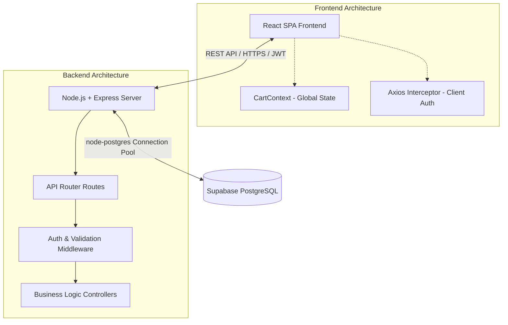
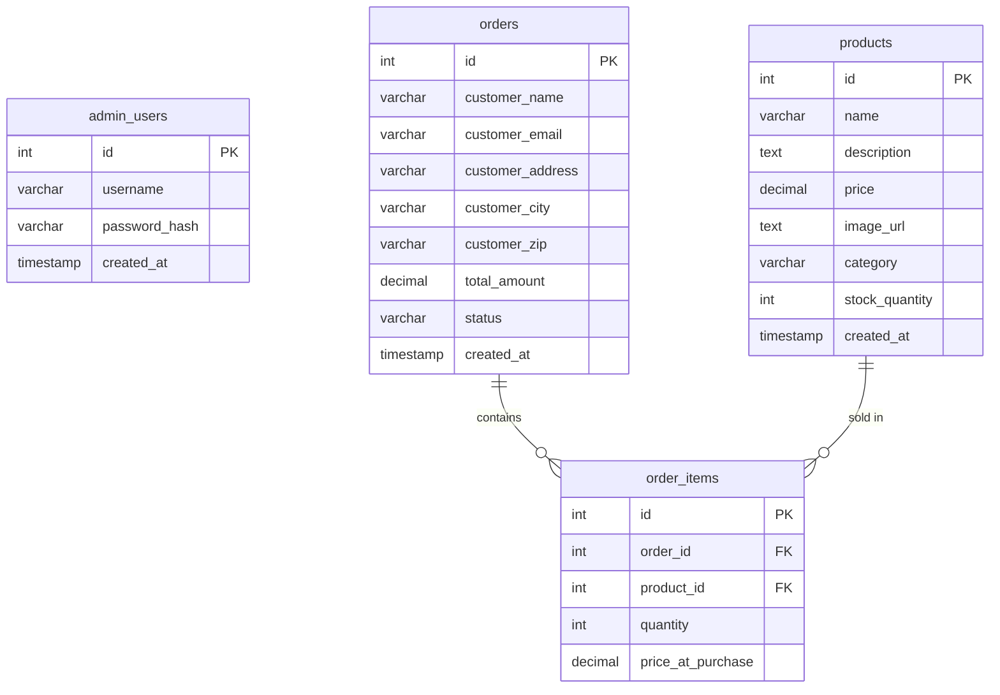

# TribeShop System Architecture

TribeShop is a premium, lightweight, and modern full-stack e-commerce application. It is architected using a decoupled **client-server model** consisting of a React-based Single Page Application (SPA) on the frontend and a Node.js + Express REST API on the backend, backed by a PostgreSQL database instance (via Supabase).

---

## 1. System Overview & Data Flow

### High-Level Data Flow:
1. **Catalog Browsing**: The React Client fetches product listings from the Express server, which queries the Supabase PostgreSQL database and responds with JSON arrays.
2. **State Management**: Cart state (items, quantity, and product info) is managed locally in memory using the React Context API (`CartContext`).
3. **Transactional Checkout**: Upon checkout, the Client submits a payload containing customer info and order items. The server verifies stock levels, decrements inventory, and records the order within a database transaction.
4. **Admin Dashboard**: Admin activities require authentication. The client logs in, receives a JWT (JSON Web Token), stores it in `localStorage`, and includes it in the `Authorization` header for subsequent admin actions.

---

## 2. Database Schema

The database consists of four tables defined in [schema.sql](file:///c:/Users/saloni.malhotra/.gemini/antigravity-ide/scratch/tribeshop/backend/src/db/schema.sql):

### Performance & Indices:
- **`idx_products_category`**: Speeds up category-based catalog filtering.
- **`idx_orders_email`**: Accelerates lookup of orders by customer email.
- **`idx_order_items_order_id`**: Optimizes retrieval of items associated with an order.

---

## 3. Backend Architecture (Express REST API)

The backend is located in the [backend/](file:///c:/Users/saloni.malhotra/.gemini/antigravity-ide/scratch/tribeshop/backend) directory and operates on a traditional **Controller-Middleware-Router** pattern.

- **Entry Point**: [server.js](file:///c:/Users/saloni.malhotra/.gemini/antigravity-ide/scratch/tribeshop/backend/src/server.js) initializes Express, loads security headers with `helmet`, configures CORS, mounts the routes, and binds the global error handling middleware.
- **Database Connection**: [db.js](file:///c:/Users/saloni.malhotra/.gemini/antigravity-ide/scratch/tribeshop/backend/src/config/db.js) sets up a `pg.Pool` connection pool for high-throughput Postgres interaction.
- **Routes & Controllers**:
  - **Auth**: [auth.routes.js](file:///c:/Users/saloni.malhotra/.gemini/antigravity-ide/scratch/tribeshop/backend/src/routes/auth.routes.js) calls [auth.controller.js](file:///c:/Users/saloni.malhotra/.gemini/antigravity-ide/scratch/tribeshop/backend/src/controllers/auth.controller.js) for admin authentication and token issuance.
  - **Products**: [product.routes.js](file:///c:/Users/saloni.malhotra/.gemini/antigravity-ide/scratch/tribeshop/backend/src/routes/product.routes.js) handles listing (public) and mutating CRUD operations (admin protected) via [product.controller.js](file:///c:/Users/saloni.malhotra/.gemini/antigravity-ide/scratch/tribeshop/backend/src/controllers/product.controller.js).
  - **Orders**: [order.routes.js](file:///c:/Users/saloni.malhotra/.gemini/antigravity-ide/scratch/tribeshop/backend/src/routes/order.routes.js) handles customer order submission and admin order views via [order.controller.js](file:///c:/Users/saloni.malhotra/.gemini/antigravity-ide/scratch/tribeshop/backend/src/controllers/order.controller.js).
- **Middlewares**:
  - [auth.middleware.js](file:///c:/Users/saloni.malhotra/.gemini/antigravity-ide/scratch/tribeshop/backend/src/middleware/auth.middleware.js): Validates JWT from the `Authorization: Bearer <token>` header to authenticate admin requests.
  - [validator.middleware.js](file:///c:/Users/saloni.malhotra/.gemini/antigravity-ide/scratch/tribeshop/backend/src/middleware/validator.middleware.js): Validates request payloads (body schemas) before executing controllers.
  - [error.middleware.js](file:///c:/Users/saloni.malhotra/.gemini/antigravity-ide/scratch/tribeshop/backend/src/middleware/error.middleware.js): Catches all unhandled errors, ensuring no stack traces leak to the client and responding with standardized JSON errors.

---

## 4. Frontend Architecture (React SPA)

The frontend is located in the [frontend/](file:///c:/Users/saloni.malhotra/.gemini/antigravity-ide/scratch/tribeshop/frontend) directory and built with Vite + React.

- **Routing Structure**: Defined in [App.jsx](file:///c:/Users/saloni.malhotra/.gemini/antigravity-ide/scratch/tribeshop/frontend/src/App.jsx) using React Router DOM.
  - **Public Routes**: Homepage, Product List, Product Detail, Cart, and Checkout.
  - **Protected Admin Routes**: Wrapped inside [ProtectedRoute.jsx](file:///c:/Users/saloni.malhotra/.gemini/antigravity-ide/scratch/tribeshop/frontend/src/components/ProtectedRoute.jsx) which checks if an admin token exists in local storage.
- **State Management**:
  - **`CartContext`** in [CartContext.jsx](file:///c:/Users/saloni.malhotra/.gemini/antigravity-ide/scratch/tribeshop/frontend/src/context/CartContext.jsx) manages global cart additions, quantity modifications, price calculations, and local storage persistence.
- **API Services**:
  - [api.js](file:///c:/Users/saloni.malhotra/.gemini/antigravity-ide/scratch/tribeshop/frontend/src/services/api.js) exports an Axios instance pre-configured with the base URL. It includes an interceptor that automatically attaches the JWT token from `localStorage` if it exists.
- **Styling**:
  - The look-and-feel is driven by premium custom CSS rules defined in [index.css](file:///c:/Users/saloni.malhotra/.gemini/antigravity-ide/scratch/tribeshop/frontend/src/index.css), ensuring highly polished interactions, animations, and typography without relying on large CSS utility frameworks.

---

## 5. Security Design

1. **Authentication**: All endpoints mutating system resources (products, order status, etc.) require an active admin JWT session.
2. **Password Security**: Admin password hashing uses `bcryptjs` with a cost factor of 10.
3. **Data Integrity**: Orders placement validates stock quantities and performs order/item creation inside a transaction.
4. **Transport Security Headers**: Express app uses `helmet` middleware to set HTTP headers like CSP, HSTS, frame options, and referrer policies.
